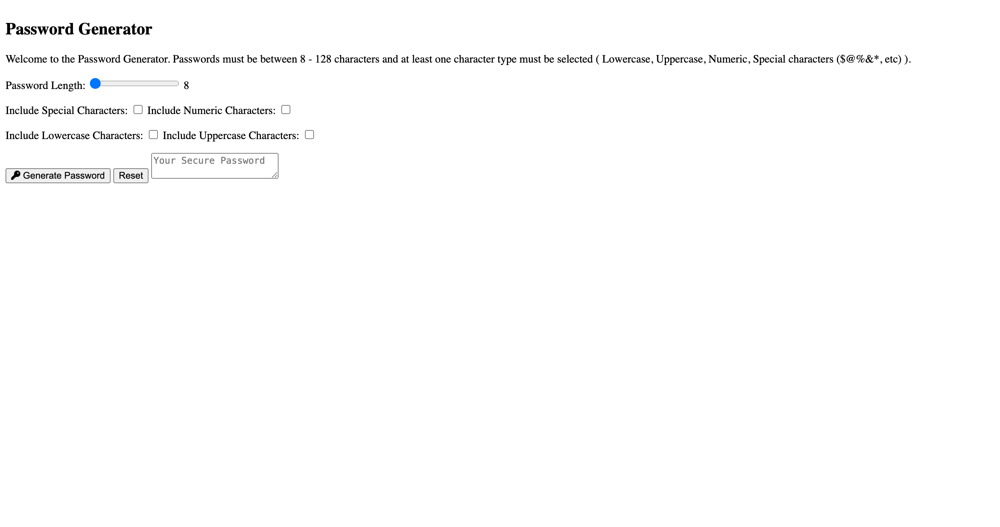

# password-generator-temiakin
Password generator application.

## Description
Built an application that an employee can use to generate a random password based on criteria that they have selected.

## Badges

## Visuals

## Installation

## Usage

## Support

## Roadmap

## Contributing
Pull requests are welcome. For major changes, please open an issue first to discuss what you would like to change.

Please make sure to update tests as appropriate.

## Authors and acknowledgment

## License
[MIT](https://choosealicense.com/licenses/mit/)

## Project status